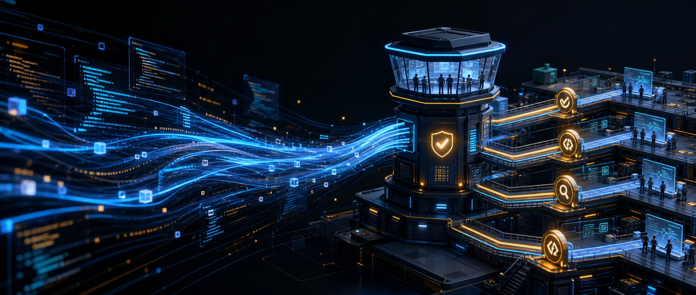
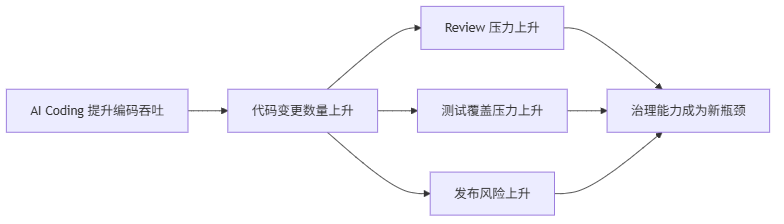
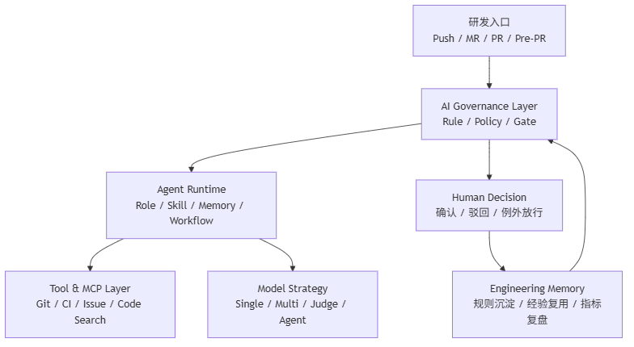

# 当 90% 代码由 AI 生成，研发治理会发生什么变化？



如果一个团队里，90% 的代码都开始由 AI 辅助生成，研发效率是不是就会线性提升？

刚开始看，答案很像是肯定的。

需求来了，工程师不用再从空白文件开始写。接口、DTO、转换逻辑、单元测试、配置样板，都可以让 AI 先生成一版。过去半天才能搭出来的代码，现在十几分钟就能有一个可运行版本。

这种提速是真实的。

但跑一段时间后，很多团队会遇到一个反直觉的问题：

> AI Coding 没有自动降低系统复杂度，它只是让复杂度增长得更快。

这也是我做 Review Agent 这个项目时越来越强烈的体感。

真正的问题不在于 AI 会不会写代码。它当然会写，而且会越写越快。

真正的问题是：当每个人都能更快地产生代码，团队是否也有能力更快地判断这些代码该不该进入系统。

## 写代码变快了，系统变好吗？

AI Coding 最直接的改变，是把“写代码”的成本打下来了。

过去一个工程师写一个功能，需要自己拆接口、想命名、补异常、查工具类、参考历史实现。现在很多动作都可以交给 AI 批量完成。

这当然是好事。

但一个复杂系统能不能长期健康，并不只取决于代码产出速度。它更取决于一些更慢、更隐性的东西：

- 业务边界有没有被守住。
- 分层依赖有没有被破坏。
- 异常处理是否一致。
- 安全风险有没有被提前识别。
- 性能隐患有没有藏进调用链深处。
- 新代码是否继续放大历史技术债。
- 团队对“什么是好代码”的判断是否一致。

AI 可以很快生成一段看起来合理的代码，但它不会天然理解一个团队过去踩过哪些坑，也不会自动知道某个项目里哪些边界绝对不能碰。

更麻烦的是，大模型非常擅长模仿上下文。

如果一个仓库结构清晰、规范稳定、边界明确，AI 往往能顺着正确模式生成还不错的代码。

但如果一个仓库里已经有不少历史包袱，命名混乱、分层模糊、工具类滥用、Controller 里掺杂业务逻辑，AI 也会非常认真地学习这些坏味道，然后用更快的速度复制它们。

比如一个系统里长期存在这样的写法：

```java
@RestController
public class OrderController {

    @Autowired
    private JdbcTemplate jdbcTemplate;

    @PostMapping("/orders/{id}/confirm")
    public Result<?> confirm(@PathVariable Long id) {
        Map<String, Object> order = jdbcTemplate.queryForMap(
            "select * from orders where id = " + id
        );

        if ("PAID".equals(order.get("status"))) {
            jdbcTemplate.update(
                "update orders set status = 'CONFIRMED' where id = " + id
            );
        }

        return Result.success();
    }
}
```

这段代码的问题并不神秘：Controller 直连数据库、SQL 拼接、业务规则散落、缺少事务边界、状态流转没有被领域模型约束。

如果仓库里到处都是这种模式，AI 很可能不会主动停下来问：“这个系统是不是应该先重构分层？”

它更可能生成一个“风格一致”的新接口：

```java
@PostMapping("/orders/{id}/cancel")
public Result<?> cancel(@PathVariable Long id) {
    jdbcTemplate.update(
        "update orders set status = 'CANCELLED' where id = " + id
    );
    return Result.success();
}
```

看起来很快。

也确实能跑。

但系统秩序又往下掉了一点。

所以 AI Coding 的第一个风险是：

> 它不会自动修复工程秩序，反而会放大已有的工程秩序。

秩序好的地方，它会提速。

秩序差的地方，它也会提速。

只是提速的东西不一样。

## 个人效率提升，为什么会变成团队风险？

很多团队刚开始使用 AI Coding 时，关注点都在个人效率。

一个人一天能写更多代码。

一个需求能更快出 Demo。

一个新人能更快补齐不熟悉的技术栈。

这些收益都是真实的。但如果只看个人效率，很容易忽略另一个问题：团队的审查、协作和治理能力并没有同步提速。

过去一个人一天写 300 行代码，Reviewer 还能勉强看完。

现在一个人一天在 AI 帮助下产出 1500 行代码，Reviewer 的时间并不会自动变成 5 倍。

于是瓶颈开始转移。

以前瓶颈在“写不快”。

现在瓶颈在“看不过来”“判断不过来”“治理不过来”。

可以把这个变化简化成一个研发链路：



这就是 AI Coding 之后 Code Review 变得更重要的原因。

AI 提升了编码吞吐，但也把压力系统性地推向了下游：

- Review 要看更多代码。
- 测试要覆盖更多分支。
- 架构师要判断更多边界变化。
- 发布流程要承接更多风险。
- 团队规范要约束更多自动生成的实现。

如果没有新的治理机制，AI Coding 很容易让团队进入一种表面高效、底层失控的状态。

看起来需求交付更快了。

但系统里的隐性债务也在更快积累。

## 传统研发治理为什么不够用了？

传统研发治理主要靠三件事。

第一，文档规范。

比如代码规范、分层规范、安全规范、发布 SOP。

第二，人工 Review。

靠资深工程师在 PR 里发现问题，指出风险。

第三，流程卡点。

比如上线前检查、测试验收、架构评审、发布审批。

这些机制在过去是有效的。但 AI Coding 时代，它们会遇到一个共同问题：

> 规范是静态的，代码生成是高频的；人工审查是有限的，AI 产出是放大的。

文档写得再好，如果没有进入 AI 的生成上下文，它就只是放在知识库里的文本。

Reviewer 再认真，如果每次都要从命名、异常、分层、SQL 风险这些基础问题开始看，就会被低价值问题消耗掉。

流程卡点再严格，如果只在最后一刻才发现问题，修复成本也会很高。

这也是很多团队会误判的地方。

大家以为“给 AI 写几条规则”就够了。

但真正的顺序应该反过来：

> 先让团队对齐工程标准，再把这些标准变成 AI 可以执行的约束。

也就是先“人人对齐”，再“人机对齐”。

如果团队自己都没有统一判断，同一条规则在不同人眼里有不同解释，那 AI Rule 写得再漂亮，也很难稳定工作。

AI 只能执行输入，不能替团队形成共识。

这时候，规则不应该只停留在文档里，而应该变成更接近机器可执行的形式。

比如一条架构规则，口语化描述是：

> Controller 不能直接访问数据库，也不能直接编排复杂业务逻辑。

落到治理系统里，可以被表达成更结构化的规则：

```json
{
  "id": "architecture.controller-no-db-access",
  "severity": "BLOCKER",
  "scope": "backend",
  "match": {
    "classAnnotation": "RestController",
    "forbiddenDependencies": [
      "JdbcTemplate",
      "EntityMapper",
      "Repository"
    ]
  },
  "message": "Controller 不允许直接访问数据库，请通过 Application Service 编排业务流程。"
}
```

这段配置不是为了替代架构师。

它的意义在于，把团队已经达成共识的规则，从“靠人记住”变成“系统默认执行”。

## Agent 真正应该做什么？

这也是我后来对 Agent 的理解变化。

刚开始看，Agent 很容易被理解成“更会聊天的大模型”，或者“能自动调用工具的 Prompt”。

但放到工程场景里，这个理解太浅了。

工程 Agent 真正有价值的地方，不是替人多写几行代码，而是承担一部分可结构化、可重复、可审计的工程治理动作。

比如：

- 在提交前做 Pre-PR 检查。
- 按团队规则扫描代码风险。
- 用多个模型交叉审查同一段变更。
- 让 Judge 模型汇总不同模型的意见。
- 把 BLOCKER、MAJOR、MINOR、INFO 分成不同处理等级。
- 自动生成 PR Summary 和阻断原因。
- 把团队 SOP 编译成可执行流程。
- 让人只处理真正需要人判断的业务语义、架构取舍和风险接受。

一个工程 Agent 不应该只是这样：

```text
请帮我 Review 这段代码，指出问题。
```

更合理的方式，是让它带着角色、规则、工具和流程进入现场：

```yaml
agent:
  role: ARCHITECT_REVIEWER
  goal: "识别架构边界、分层依赖和高风险技术债"
  skills:
    - JavaCodeStyleSkill
    - ExceptionHandlingSkill
    - PerformanceSkill
  tools:
    - GitDiffTool
    - ReadFileTool
    - CodeStructureTool
  rules:
    - architecture.controller-no-db-access
    - architecture.application-no-infrastructure-leak
  output:
    format: finding
    severity:
      - BLOCKER
      - MAJOR
      - MINOR
      - INFO
```

这时 Agent 就不再只是 Prompt。

它至少需要几个组成部分：

- Role：它以什么角色工作，是安全审计、性能分析，还是架构评审。
- Skill：它具备哪些专业能力，比如异常处理、安全扫描、代码规范。
- Tool：它能不能读 Git diff、读文件、查调用链、保存审查结果。
- Rule：它必须遵守哪些团队约束。
- Memory：它能不能沉淀团队过去的经验。
- Workflow：它如何进入 Pre-PR、Review、测试、发布这些真实流程。

也就是说，Agent 的核心不是“会回答”，而是“能在一个受控流程里执行工程判断”。

## 从 AI Review 工具到研发治理平台

Review Agent 这个项目最初看起来是一个 AI Code Review 工具。

但继续往下做，就会发现它自然会长成一个更大的系统。

因为只做 Review 不够。

你会需要模型配置中心，管理不同模型、供应商、能力标签和调用策略。

你会需要多模型 Review，让不同模型互相补位。

你会需要 Judge，让模型产出的审查意见有二次判断。

你会需要 Pre-PR Gate，在正式 PR 前先过滤掉基础风险。

你会需要 Rule 和 Skill，把团队规范变成 AI 可以执行的约束。

你会需要 Workflow，把审查、测试、发布、重构串起来。

你还会需要知识记忆和运营看板，知道这些 Agent 到底有没有提升质量，有没有减少人工负担，有没有拦住真正该拦的问题。

我心里比较理想的形态，大概是这样：



到这一步，它就不再只是一个 Review 工具。

它更像是：

> AI Coding 时代的研发治理基础设施。

我更愿意把它叫做 AI Engineering Governance Platform。

它解决的不是“怎么让 AI 写更多代码”，而是“怎么让团队在 AI 写更多代码之后，仍然保持工程秩序”。

## 工程师的角色也变了

这件事背后还有一个更大的变化。

当 AI 能写越来越多代码，工程师的价值并不会消失，但重心会迁移。

过去，很多经验体现在“我能看全这个系统”“我知道这段代码该怎么写”“我熟悉这些历史坑”。

未来，这些经验仍然重要，但表达方式会变。

资深工程师要做的，不只是自己写出正确代码，而是把自己的判断结构化：

- 哪些边界不能破。
- 哪些风险必须阻断。
- 哪些问题可以提示但不阻塞。
- 哪些场景必须人工复核。
- 哪些经验应该沉淀成 Rule。
- 哪些能力应该封装成 Skill。
- 哪些流程应该进入 Workflow。

比如一个 Pre-PR Gate 的策略，可以被设计成这样：

```yaml
gatePolicy:
  blockOn:
    - BLOCKER
  requireHumanReviewOn:
    - MAJOR
  advisoryOn:
    - MINOR
    - INFO
  decision:
    BLOCKER: "阻断提交，必须修复"
    MAJOR: "进入人工复核"
    MINOR: "建议修复，不阻断"
    INFO: "记录提示"
```

这段配置背后的重点不是 YAML。

重点是团队终于把“什么问题必须拦，什么问题需要人看，什么问题可以提示”讲清楚了。

换句话说，工程师越来越像是在设计一个能让 AI 可靠工作的工程环境。

这不是把人从系统里拿掉。

恰恰相反，这是把人的判断放到更高价值的位置。

人不应该被困在重复检查里。

人应该负责定义标准、判断取舍、处理例外、承担最终责任。

AI 负责高频执行。

Agent 负责把执行过程变成可追踪、可审计、可治理的系统。

## 结尾

AI Coding 的真正挑战，不是代码会不会越来越多。

代码一定会越来越多。

真正的挑战是：当代码产出速度被 AI 放大之后，团队有没有一套新的机制，去约束、审查、沉淀和治理这些代码。

如果没有，AI 只会让系统更快地走向混乱。

如果有，AI 才可能真正变成工程效率的放大器。

所以这个系列想讨论的，不是“如何写一个更聪明的 Prompt”，也不是“如何接一个更强的模型”。

我更想从一个 Review Agent 项目的实践出发，拆开聊聊：

- Pre-PR Gate 应该怎么设计。
- 多模型 Review 为什么有必要。
- Judge Agent 的边界在哪里。
- Agent 为什么不能只有 Prompt。
- MCP 和工具层怎么进入工程现场。
- Rule、Skill、SOP 如何把团队经验变成可执行约束。
- 最后，一个 AI Review 工具如何演进成 AI Engineering Governance Platform。

下一篇，我们先从最直接的瓶颈开始：

> 为什么 Code Review 会成为 AI Coding 之后的新瓶颈？
