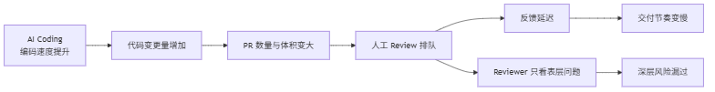
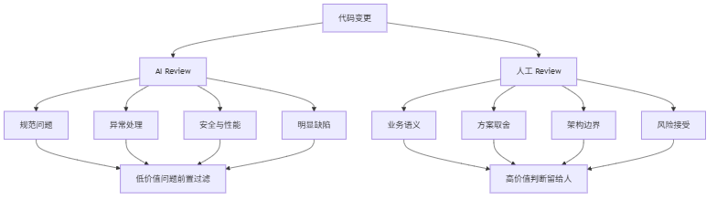
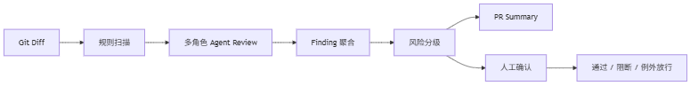

# 为什么 Code Review 会成为 AI Coding 之后的新瓶颈？

封面图中文提示词：

> 一张公众号科技文章封面图，主题是“AI Coding 之后 Code Review 成为新瓶颈”。画面左侧是大量 AI 生成的代码流高速涌入，右侧是人工评审台和质量门禁，评审台前出现排队、压力、风险分级等视觉元素。整体风格现代、克制、工程感强，深色背景，蓝色代码流和橙色风险提示作为点缀，不要文字、不要 Logo、不要水印，适合宽幅公众号封面。

上一篇聊到一个判断：

> AI Coding 没有自动降低系统复杂度，它只是让复杂度增长得更快。

这篇继续往下拆。

当 AI 把编码速度提上去之后，研发链路里最先被冲击的，往往不是开发环节，而是 Code Review。

这件事很容易被低估。

因为大家谈 AI Coding，第一反应通常是“写得更快了”。但在真实团队里，代码不是写完就结束。代码要进入主干，要被发布，要长期留在系统里。

所以真正的问题不是：

> AI 能不能帮我更快写完代码？

而是：

> 当 AI 帮所有人更快写完代码之后，谁来判断这些代码能不能进系统？

这就是 Code Review 会成为新瓶颈的原因。

## AI 提速的是编码，不是整个研发系统

AI Coding 压缩的是编码时间。

过去一个接口要半天，现在可能十几分钟就能生成一版。

过去一个 DTO、Converter、Mapper 要手写，现在可以让 AI 一次补齐。

过去写测试很烦，现在可以先让 AI 生成基础用例。

但研发系统不是只有“编码”一个环节。

一个变更从想法到上线，至少要经过：

- 方案判断
- 代码实现
- 自测验证
- Code Review
- CI 检查
- 发布准入
- 线上观察

AI 让其中一个环节变快了，不代表全链路都会自动变快。

恰恰相反，当编码环节突然提速，下游环节会立刻承压。



这也是很多团队接入 AI Coding 后的体感：

代码出来得更快了。

PR 变多了。

每个 PR 的 diff 变大了。

Reviewer 开始排队。

最后大家发现，AI 提升的那部分效率，被 Review 的等待和返工吃掉了。

如果没有新的 Review 机制，AI Coding 的提效很容易停在个人层面，无法稳定转化成团队吞吐。

## 人工 Review 被迫看太多低价值问题

Code Review 的价值，本来不应该是“帮别人查拼写错误”。

人工 Review 最值钱的地方，是判断那些机器不容易判断、但对系统长期健康很重要的问题：

- 这个方案是不是绕远了？
- 这个边界是不是放错层了？
- 这个抽象会不会过早？
- 这个接口语义是否清晰？
- 这个改动是否引入隐性兼容风险？
- 这个需求是不是应该换一种实现方式？

但现实里，Reviewer 经常被大量低价值问题拖住。

比如：

- 命名不统一。
- 异常被吞掉。
- 日志缺少关键上下文。
- SQL 拼接有风险。
- Controller 里塞了业务逻辑。
- 空指针分支没处理。
- 测试只覆盖了 happy path。

这些问题重要吗？

重要。

但它们不应该主要靠人肉一遍遍发现。

如果一个资深工程师每次 Review 都要从这些基础问题开始扫，他的大脑就被消耗在“重复检查”上，而不是“关键判断”上。

这在 AI Coding 时代会更明显。

因为 AI 生成的代码通常有两个特点：

第一，它很完整。

接口、DTO、注释、测试、配置，看上去什么都有。

第二，它很自信。

即使有问题，也经常包装在一段看似顺滑的实现里。

Reviewer 面对的不是空白，而是一堆“看起来差不多能跑”的代码。

这种代码最消耗判断力。

## 一个典型例子：代码能跑，但不该进主干

假设 AI 根据需求生成了这样一段代码：

```java
@PostMapping("/coupons/{id}/receive")
public Result<?> receiveCoupon(@PathVariable Long id, @RequestParam Long userId) {
    Coupon coupon = couponMapper.selectById(id);
    if (coupon == null) {
        return Result.fail("优惠券不存在");
    }

    if (coupon.getStock() <= 0) {
        return Result.fail("库存不足");
    }

    coupon.setStock(coupon.getStock() - 1);
    couponMapper.updateById(coupon);

    UserCoupon userCoupon = new UserCoupon();
    userCoupon.setUserId(userId);
    userCoupon.setCouponId(id);
    userCouponMapper.insert(userCoupon);

    return Result.success();
}
```

这段代码从“能不能跑”的角度看，似乎问题不大。

但从 Review 的角度看，问题不少：

- Controller 直接编排业务流程。
- 没有事务边界。
- 库存扣减存在并发超卖风险。
- 没有校验用户是否已领取。
- 失败场景没有统一错误码。
- 缺少幂等设计。
- 缺少关键操作日志。

如果团队有 AI Review，这些基础风险可以先被前置识别。

例如输出成结构化 Finding：

```json
{
  "severity": "BLOCKER",
  "category": "CONCURRENCY",
  "title": "优惠券库存扣减存在并发超卖风险",
  "evidence": "先 select 再 update，缺少乐观锁或原子扣减条件",
  "suggestion": "使用 update coupon set stock = stock - 1 where id = ? and stock > 0，并检查影响行数",
  "needHumanReview": false
}
```

然后 Reviewer 就不用先花精力证明“这里可能超卖”。

他可以直接进入更高价值的问题：

> 这个领取流程是否应该支持幂等？库存扣减失败后用户体验怎么处理？优惠券领取是否属于核心链路，需要单独做压测和降级？

这才是人工 Review 应该站的位置。

## 人工 CR 应该从“查错”转向“判断”

AI Coding 之后，人工 CR 的职责需要重新划分。

以前很多团队默认 Reviewer 什么都看：

- 看代码风格。
- 看异常处理。
- 看安全风险。
- 看业务逻辑。
- 看架构设计。
- 看测试覆盖。
- 看发布风险。

结果就是每个人都很累，而且 Review 质量不稳定。

AI Review 介入后，更合理的分工应该是：



AI Review 负责高频、可规则化、可结构化的问题：

- 代码规范
- 异常处理
- 安全风险
- 性能隐患
- 空指针和边界分支
- 明显的测试缺口
- 常见架构违规

人工 Review 负责低频、语义化、需要上下文判断的问题：

- 业务规则是否正确
- 技术方案是否合理
- 架构边界是否值得接受
- 是否有更简单的实现路径
- 当前风险是否可以例外放行
- 这次变更是否解决了正确的问题

换句话说，AI 不应该替代 Reviewer。

AI 应该把 Reviewer 从低价值检查里释放出来。

## Review Agent 的第一层价值：过滤低价值问题

Review Agent 的第一层价值，不是“完全自动审代码”。

这句话很重要。

如果一上来就追求“AI 自动完成所有 Review”，很容易走偏。

因为真实工程里的 Review 不只是找 bug，它还包含大量上下文判断。很多问题不是“对或错”，而是“在当前业务阶段是否值得接受”。

所以更务实的目标应该是：

> 让 AI 先过滤掉基础问题，让人集中处理关键判断。

一个 Review Agent 的基础流程可以设计成这样：



这里的关键点是结构化。

AI 不能只是返回一段长篇评论：

```text
这段代码整体还可以，但建议注意并发问题、异常处理问题、日志问题、事务问题……
```

这种输出看起来很热闹，但很难进入工程流程。

更好的方式是把问题拆成可处理的 Finding：

```json
{
  "file": "CouponController.java",
  "line": 18,
  "severity": "MAJOR",
  "category": "TRANSACTION",
  "title": "领取流程缺少事务边界",
  "evidence": "库存扣减和领取记录插入分两步执行，中间失败会导致数据不一致",
  "suggestion": "将领取流程下沉到 Application Service，并使用事务包裹库存扣减和领取记录创建",
  "humanStatus": "PENDING"
}
```

结构化之后，平台才能继续做后面的事情：

- 按严重等级排序。
- 聚合重复问题。
- 判断是否阻断。
- 生成 PR Summary。
- 进入人工确认。
- 沉淀规则和团队记忆。

没有结构化，AI Review 就只是“多了一个评论者”。

有了结构化，它才可能进入研发治理系统。

## 为什么不能只靠大模型直接 Review？

很多人会问：既然大模型已经能看代码，为什么还要做 Review Agent 平台？

直接把 diff 丢给模型，让它输出建议，不就行了吗？

短期可以。

长期不够。

原因有四个。

第一，模型输出不稳定。

同一段代码，不同模型、不同提示词、不同上下文，结论可能会不一样。

第二，模型不知道团队标准。

它知道通用最佳实践，但不知道你的团队哪些问题必须阻断，哪些问题可以暂时接受。

第三，模型不会天然进入流程。

它可以生成建议，但建议如何关联到文件、行号、严重等级、人工状态、Gate 结果，需要平台承接。

第四，模型输出很难复盘。

如果只是聊天记录，就很难回答这些问题：

- 哪类问题最多？
- 哪个模型误报高？
- 哪些规则最常被违反？
- AI Review 有没有减少人工负担？
- 哪些 BLOCKER 真正拦住了线上风险？

所以，AI Review 的工程化重点，不是“调用一次模型”，而是围绕模型建立一套可复用、可治理、可度量的系统。

## Review 的目标不是更慢地卡人，而是更快地放行正确变更

治理这个词很容易让人紧张。

一听治理，就像要增加流程、增加审批、增加阻力。

但好的 Review Agent 不应该让研发更慢。

它的目标恰恰相反：

> 更快地放行低风险变更，更稳地拦住高风险变更。

所以 Review Agent 里需要有风险分级。

比如：

```yaml
severityPolicy:
  BLOCKER:
    meaning: "必须修复，否则不能进入 PR"
    examples:
      - "明确安全漏洞"
      - "高概率数据不一致"
      - "核心链路并发风险"
  MAJOR:
    meaning: "需要人工确认"
    examples:
      - "架构边界争议"
      - "重要异常分支缺失"
      - "测试覆盖不足"
  MINOR:
    meaning: "建议修复，不默认阻断"
    examples:
      - "命名不够清晰"
      - "日志上下文不足"
  INFO:
    meaning: "提示和记录"
```

有了分级，团队就不会陷入两个极端：

一个极端是 AI 发现什么都阻断，最后大家绕过它。

另一个极端是 AI 只给建议，从来不影响流程，最后没人认真看。

真正有效的治理，需要把问题分层。

该拦的必须拦。

该让人看的交给人。

该提示的就提示。

## 人在 Review 中的价值反而更高了

AI Review 不是为了把人从 Review 里拿掉。

恰恰相反，它会让人的判断更值钱。

当 AI 把基础问题过滤掉之后，Reviewer 可以把注意力放在更难的问题上：

- 这个设计是不是过度复杂？
- 这个抽象未来能不能承载变化？
- 这次变更是否破坏了领域边界？
- 这个需求是不是应该先补产品约束？
- 这个风险是否可以在当前阶段接受？

这些问题没有标准答案。

也不应该完全交给模型。

因为它们背后涉及业务阶段、团队能力、历史包袱、发布时间、事故成本、组织取舍。

这才是人最该负责的地方。

AI 负责高频扫描。

Agent 负责流程承接。

人负责最终判断。

这三个角色分清楚，Review 才可能从瓶颈变成质量放大器。

## 结尾

AI Coding 让代码产出变快。

但只要代码还要进入复杂系统，Review 就不会消失。

相反，Review 会变得更重要。

因为它从过去的“代码质量检查”，变成了 AI Coding 时代的“工程治理入口”。

如果团队没有新的 Review 机制，AI 写得越快，Reviewer 越堵，系统风险越难控制。

如果团队能把 AI Review、结构化 Finding、风险分级、人工确认和质量门禁串起来，Code Review 就不再只是一个人工环节。

它会变成一个新的治理系统。

下一篇，我们就继续往前走一步：

> Pre-PR Gate：为什么 AI Review 应该前置到提交之前？

