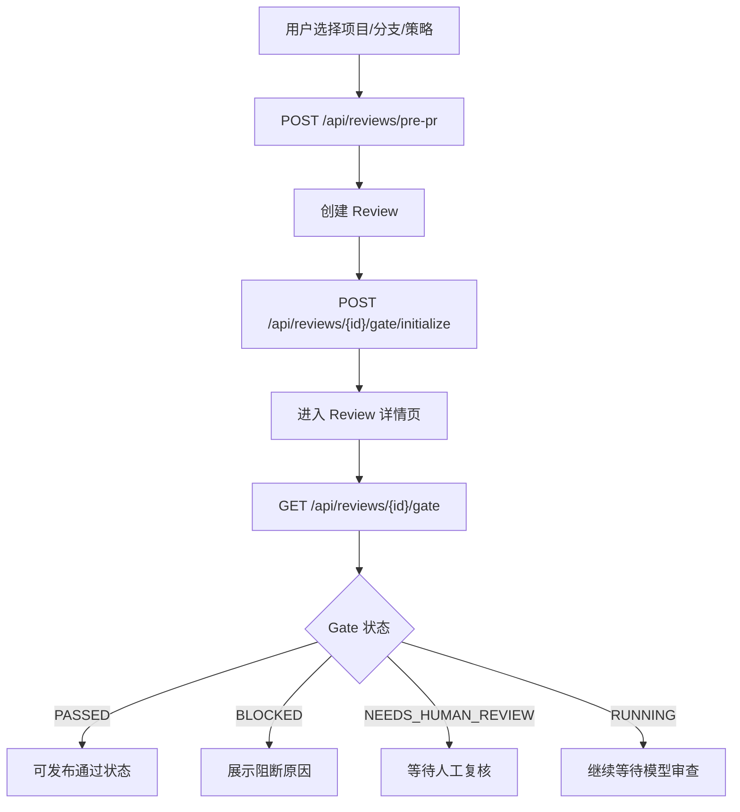
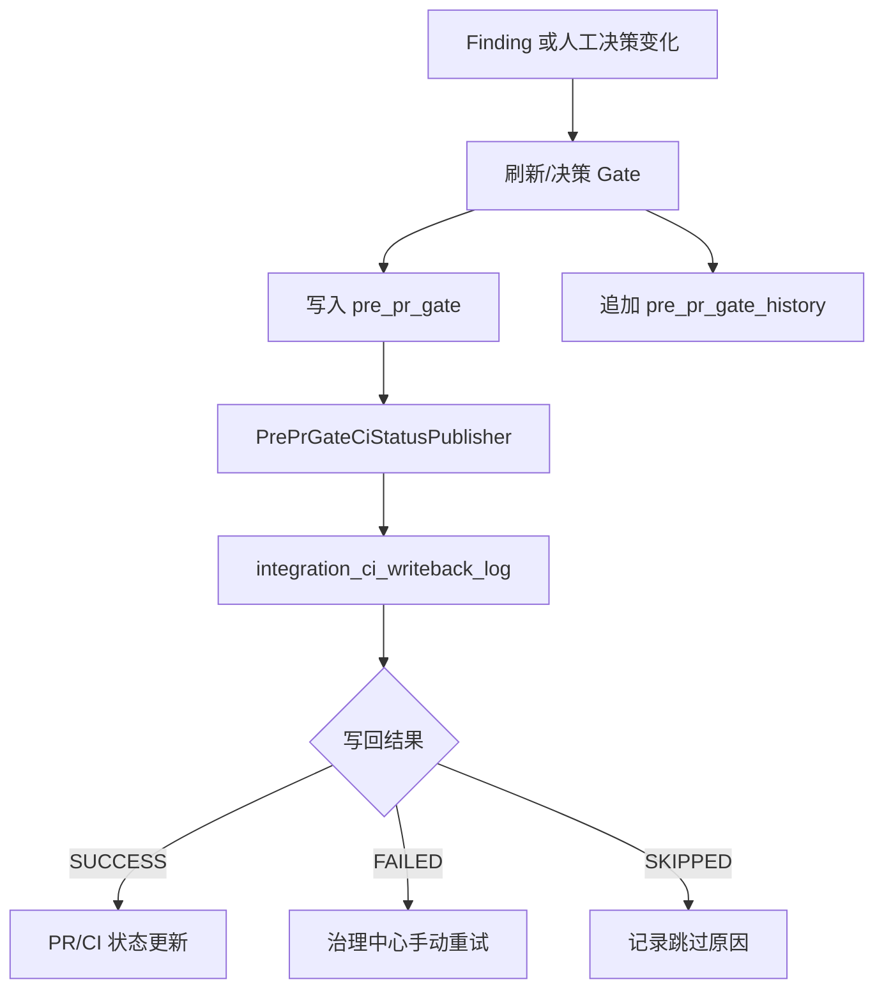
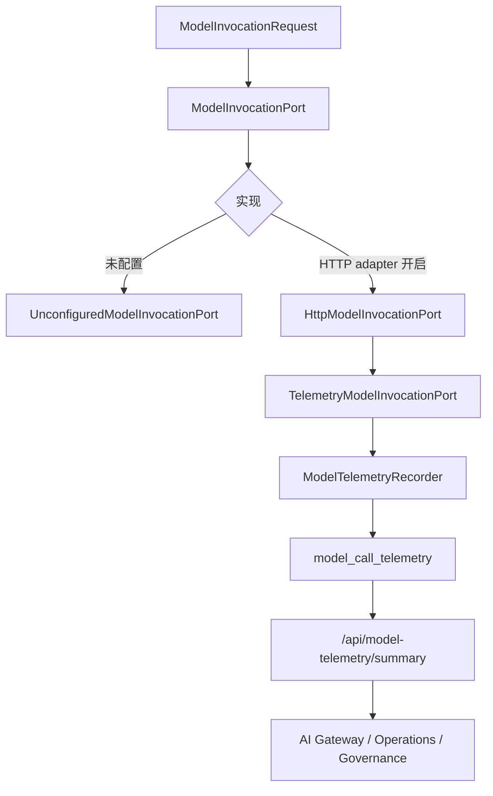
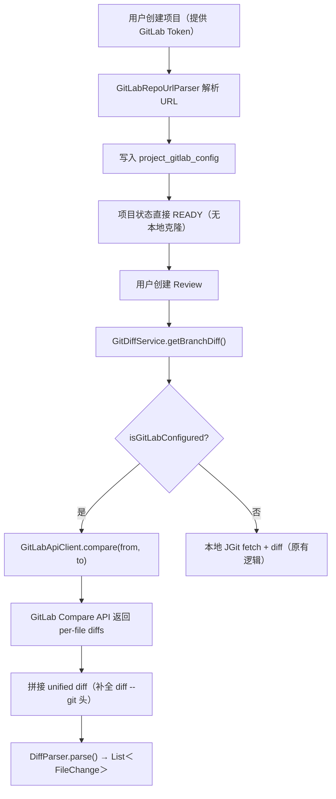
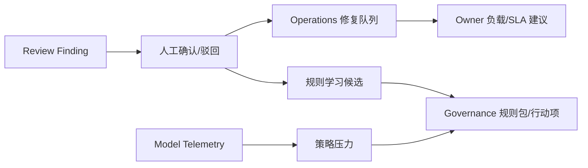

# Review Agent 当前功能设计与实现现状

> 更新时间：2026-07-03  
> 范围：基于当前仓库可读源码、前端页面调用、数据库迁移、`docs/api-catalog.md` 和阶段执行日志整理。部分后端主链路文件仍存在 Esafenet 保护内容，本文只把可读源码和已确认调用契约作为确定实现。

## 1. 产品定位

Review Agent 当前已经不是单点的“AI 代码审查工具”，而是在向 **研发质量治理平台** 演进。

它的核心设计目标是把以下动作串成闭环：

1. 项目接入和仓库分支读取。
2. 创建普通 Review 或 Pre-PR Review。
3. 多模型/多角色审查产生 Finding。
4. 后端 Pre-PR Gate 形成准入决策。
5. Gate 状态进入 CI/PR 回写链路。
6. 人工确认结果、模型遥测和运营视图反哺策略治理。
7. SARIF、PR Summary、Webhook 等集成动作进入外部工程系统。

当前系统已经具备平台骨架、主要页面和一批后端聚合接口，但仍处在“核心闭环逐步打穿”的阶段。尤其是真实模型调用主链路、部分 Review 主流程源码、受保护 Agent/Gateway 文件仍需要继续整理。

## 2. 技术栈与运行形态

| 层 | 当前实现 |
| --- | --- |
| 后端 | Spring Boot 3.3.5、Java 21、MyBatis-Plus、Flyway、MySQL、Spring AI Alibaba、JGit、JWT |
| 前端 | Vue 3、Vite 6、Ant Design Vue 4、Vue Router、TypeScript |
| 数据库 | Flyway 迁移，核心表从 `V1__init_schema.sql` 到 `V17__add_project_gitlab_config.sql` |
| API 响应 | 统一 `Result<T>`，前端通过 `/api` base path 调用 |
| 模型与 Agent | 已有 Spring AI Alibaba、模型配置、Agent/Skill/MCP 结构；部分主链路文件受 Esafenet 保护 |
| 集成 | GitHub CI Status、Webhook、SARIF upload、PR Summary comment、集成动作日志 |

## 3. 当前能力域设计

系统可以按 9 个能力域理解：

| 能力域 | 设计目标 | 当前实现状态 |
| --- | --- | --- |
| Identity & Auth | 用户注册、登录、JWT 鉴权、前端路由守卫 | 已实现基础能力；登录/注册/退出入口统一走 Auth composable；RBAC、审计、会话管理仍未完成 |
| Project & Repo | 项目登记、仓库克隆/API 直连、分支读取、项目级 Review 管理 | 基础闭环已实现；项目详情页已展示后端仓库分支列表；新增 GitLab API 模式，支持通过 Personal Access Token 直接获取 diff，无需本地克隆 |
| Review Core | 创建 Review、展示结果、Finding 人工状态、风险/测试/重构分析 | 页面和接口已接入，部分后端 Review 主链路源码仍受保护 |
| Pre-PR Gate | 后端计算、持久化、人工决策、CI 状态发布 | 后端服务与表结构已实现；前后端决策接口路径存在不一致风险 |
| Model Config | 模型供应商、模型档案、审查策略、角色绑定 | CRUD 和前端配置页已实现 |
| Model Invocation & Telemetry | 模型调用抽象、HTTP adapter、调用遥测、策略效果汇总 | `ModelInvocationPort` seam、HTTP adapter、smoke-test、遥测表和汇总已实现；真实主链路迁移未完成 |
| Governance | 治理能力目录、连接器、规则包、工作流模板、遥测行动项 | 页面和后端目录已实现，规则包变更记录、dry-run 预览、批准/应用/拒绝/回滚状态流、规则控制项写回、版本快照列表与快照详情查看已接入 |
| Operations | 统一任务视图、修复队列、Owner 负载、规则学习候选、业务收益、策略压力、遥测就绪度、CI 健康行动项 | 后端聚合接口和前端运营页已实现；统一任务视图已合并 Finding 修复项与 CI 健康异常，并支持同步到 `operations_task`、更新状态/Owner/SLA、批量分派、SLA 到期告警、GitLab Issue 创建记录、GitLab Issue 基础字段映射、手动/自动状态刷新与关闭回流、关闭任务和记录关闭原因；修复队列支持确认有效/标记误报，规则学习候选支持采纳/拒绝并生成治理变更，仍缺更多 Issue 系统 |
| Integration | CI 配置、回写日志、健康度汇总、Webhook、SARIF、PR Summary、动作日志 | 多个接口已实现；治理中心 CI 配置支持 GitHub/GitLab/Jenkins 连接器切换；后端已按 provider 分发 GitHub Status、GitLab Commit Status 与 Jenkins Gate Job 触发，Jenkins 支持 crumb 预取、队列地址记录和队列/构建结果手动与自动刷新；治理中心已展示每个 provider 的 CI 集成健康状态，并把异常健康状态转成 CI Health Actions |

## 4. 前端页面实现现状

前端路由位于 `review-agent-web/src/router/index.ts`，当前主要页面如下：

| 路由 | 页面 | 已实现体验 |
| --- | --- | --- |
| `/login` | 登录 | 登录表单、调用 `/auth/login`、写入本地登录态 |
| `/register` | 注册 | 注册表单、调用 `/auth/register` |
| 全局 Header / Layout | 退出 | 调用共享 `useAuth.logout()`，先请求 `/auth/logout`，再清理本地登录态并跳转登录页 |
| `/` | Dashboard | 项目/Review 概览、最近 Review 聚合 |
| `/projects` | 项目列表 | 分页项目列表、快速创建项目 |
| `/projects/create` | 创建项目 | 创建项目表单；支持 GitLab Token（可选）切换 API 模式 |
| `/projects`（Modal） | 项目列表快速创建 | 内联 Modal 表单，同样支持 GitLab Token |
| `/projects/:id` | 项目详情 | 项目信息、仓库分支列表、从分支发起审查、项目下 Review 列表、项目编辑与删除 |
| `/reviews/create` | 创建 Review | 选择项目、分支、策略，支持从 URL 预填项目/源分支/目标分支，提交策略 Key、reviewMode 和 modelsConfig，创建 Pre-PR Review，并初始化 Gate |
| `/reviews/:id` | Review 详情 | Review 摘要、Finding、人工状态、Gate、SARIF、PR Summary、风险/测试/重构分析 |
| `/governance` | 治理中心 | 治理目录、GitHub/GitLab/Jenkins CI 配置、CI 集成健康度、CI Health Actions、写回日志、集成动作、遥测行动项 |
| `/operations` | 运营中心 | KPI、统一任务视图、SLA Alerts、任务同步/状态流转/Owner/SLA 调整/批量分派/GitLab Issue/关闭、修复队列、Owner 负载、规则学习候选、业务收益、策略压力、遥测就绪度、CI Health Actions |
| `/settings/models` | 模型配置 | Provider/Profile/Strategy 管理、角色绑定、模型调用烟测 |
| `/knowledge` | 知识查询 | 调用知识查询接口，并按记忆、规则、发现项展示统计和筛选 |
| `/gateway` | AI Gateway | Prompt、统计、模型遥测 summary 优先展示，并支持手动写入遥测记录 |

前端的一个明显特点是：很多页面都已经具备”后端接口优先、本地兜底”的渐进式接入方式。例如 Operations 页面会优先读取后端聚合接口，接口失败时保留局部推导能力，便于分阶段后端化。

**前端布局优化（2026-07-03）：**
- 修复右侧内容区域独立垂直滚动：`app-shell` 高度固定为 `100vh`，`app-content` 使用 `flex: 1; overflow-y: auto`，左侧菜单栏和顶部标题栏保持固定。
- 治理中心页面卡片布局重构：KPI 卡片统一 `min-height: 120px`；右侧边栏卡片通过 `governance-sidebar-cards` flex 容器 + `gap: 16px` 统一间距；CI 回写就绪度卡片内容区 `max-height: 520px; overflow-y: auto` 避免撑破布局；底部行卡片等高对齐；嵌套卡片内联样式替换为 CSS class。

## 5. 后端 API 实现现状

当前可读 Controller 暴露的主要接口如下。

### 5.1 Auth

| Method | Path | 功能 |
| --- | --- | --- |
| `POST` | `/api/auth/register` | 用户注册 |
| `POST` | `/api/auth/login` | 用户登录 |
| `POST` | `/api/auth/logout` | 退出登录 |

当前实现是基础 JWT 登录态，适合单团队/内测场景。前端登录、注册和退出入口已统一到 `useAuth`，退出会调用 `/api/auth/logout` 并清理本地登录态；企业级 RBAC、组织隔离、服务端 token 失效/黑名单、审计日志未完成。

### 5.2 Project

| Method | Path | 功能 |
| --- | --- | --- |
| `POST` | `/api/projects` | 创建项目 |
| `GET` | `/api/projects` | 分页项目 |
| `GET` | `/api/projects/{id}` | 项目详情 |
| `PUT` | `/api/projects/{id}` | 更新项目 |
| `DELETE` | `/api/projects/{id}` | 删除项目 |
| `POST` | `/api/projects/{id}/retry-clone` | 重试仓库克隆 |
| `GET` | `/api/projects/{id}/branches` | 查询分支 |

项目表在 `V1__init_schema.sql` 中定义，包含仓库 URL、默认分支、本地路径、克隆状态、错误信息扩展等。项目详情页已读取 `/api/projects/{id}/branches` 展示仓库分支列表；非默认分支可直接跳转创建 Review 并预填源分支、目标分支。创建 Review 页也会读取该接口作为源分支/目标分支选项，并校验 URL 预填分支仍存在。

**GitLab API 模式（新增）：** 创建项目时可选提供 GitLab Personal Access Token，系统解析仓库 URL 提取 GitLab 实例地址和项目路径，写入 `project_gitlab_config` 表，项目状态直接标记为 `READY`，跳过本地克隆。后续获取分支列表和 diff 均通过 GitLab REST API：

- `GET /api/v4/projects/:id/repository/branches` — 获取分支列表。
- `GET /api/v4/projects/:id/repository/compare?from=...&to=...` — 获取两分支/提交之间的 diff。

GitLab API 返回的 unified diff 经前置补全 `diff --git` 头部后，复用既有 `DiffParser` 解析为结构化 `FileChange` 列表，对上游调用方完全透明。

核心实现文件：
- `infrastructure/git/GitLabApiClient.java` — RestTemplate 封装，`PRIVATE-TOKEN` 头认证。
- `infrastructure/git/GitLabDiffService.java` — 桥接层，调用 API → 拼接 diff → DiffParser 解析。
- `infrastructure/git/GitLabRepoUrlParser.java` — 支持 HTTPS/SSH URL 解析。
- `infrastructure/git/GitDiffService.java` — 入口路由层，优先检测 GitLab 配置，有则走 API，无则走本地 JGit。
- `domain/entity/ProjectGitLabConfig.java` + `V17__add_project_gitlab_config.sql` — 配置持久化。

### 5.3 Review 与分析

前端已调用的 Review 能力包括：

| Method | Path | 功能 | 当前判断 |
| --- | --- | --- | --- |
| `POST` | `/api/reviews/pre-pr` | 创建 Pre-PR Review | 前端已接入；提交项目、分支、策略 Key、reviewMode 和 modelsConfig；部分后端源码不可稳定读取 |
| `GET` | `/api/reviews` | Review 列表 | 前端已接入 |
| `GET` | `/api/reviews/{id}` | Review 详情 | 前端已接入 |
| `GET` | `/api/reviews/{id}/progress` | SSE 进度 | 前端已接入 |
| `PATCH` | `/api/reviews/{reviewId}/finding/{findingId}` | 更新 Finding 人工状态 | 前端已接入 |
| `GET` | `/api/reviews/{id}/risk` | 风险预测 | 前端已接入 |
| `POST` | `/api/reviews/{id}/generate-tests` | 测试覆盖计划 | 前端已接入 |
| `POST` | `/api/reviews/{id}/refactor-plan` | 重构计划 | 前端已接入 |
| `GET` | `/api/reviews/{id}/sarif` | SARIF 导出 | 前端已调用；API 清单后续需确认后端可读 Controller |

Review 核心表包括 `review`、`review_finding`、`review_model_result`。其中 Finding 已支持严重级别、分类、置信度、跨模型命中、人工状态。

### 5.4 Pre-PR Gate

后端可读 Controller 当前提供：

| Method | Path | 功能 |
| --- | --- | --- |
| `GET` | `/api/reviews/{id}/gate` | 查询或计算 Gate |
| `POST` | `/api/reviews/{id}/gate/initialize` | 初始化 Gate 并写历史 |
| `POST` | `/api/reviews/{id}/gate/refresh` | 重新计算 Gate 并发布 CI 状态 |
| `PATCH` | `/api/reviews/{id}/gate/decision` | 人工 Gate 决策并发布 CI 状态 |
| `POST` | `/api/reviews/{id}/gate/publish-ci` | 手动发布 Gate 到 CI |

后端 Gate 计算逻辑：

- Review 为 `PENDING` / `RUNNING` 时返回 `RUNNING`。
- 存在 `BLOCKER` Finding 时返回 `BLOCKED`。
- 没有 BLOCKER 但存在待人工处理的 `MAJOR` Finding 时返回 `NEEDS_HUMAN_REVIEW`。
- 其余情况返回 `PASSED`。
- 人工决策支持 `PASSED`、`BLOCKED`、`NEEDS_HUMAN_REVIEW`，并兼容 `APPROVED -> PASSED`。

数据表：

- `pre_pr_gate`：当前 Gate 状态、阻断原因、人工决策人、决策时间。
- `pre_pr_gate_history`：初始化和人工决策事件历史。

当前接入状态：

- 前端 Review 详情页已调用 `/reviews/{id}/gate/decision`，与当前可读后端 `PrePrGateController` 保持一致。
- Pre-PR 创建页支持通过 URL 预填 `projectId`、`sourceBranch` 和 `targetBranch`；会把所选策略编排成 `modelsConfig`，高级 JSON 覆盖会先做格式校验，提交时随 `strategyKey`、`strategyId` 和 `reviewMode` 一起发送；创建成功后会初始化 Gate。Finding 人工状态变化、人工 Gate 决策和手动 CI 发布均以持久化 Gate 为主。

### 5.5 Model Config 与模型调用

模型配置接口：

| Method | Path | 功能 |
| --- | --- | --- |
| `GET/POST` | `/api/model-config/providers` | Provider 列表与创建 |
| `GET/PUT/DELETE` | `/api/model-config/providers/{id}` | Provider 详情、更新、删除 |
| `GET/POST` | `/api/model-config/profiles` | Profile 列表与创建 |
| `GET/PUT/DELETE` | `/api/model-config/profiles/{id}` | Profile 详情、更新、删除 |
| `GET/POST` | `/api/model-config/strategies` | Strategy 列表与创建 |
| `GET/PUT/DELETE` | `/api/model-config/strategies/{id}` | Strategy 详情、更新、删除 |
| `POST` | `/api/model-config/invocations/smoke-test` | 模型调用烟测 |

模型配置数据表：

- `model_provider`
- `model_profile`
- `review_strategy`
- `review_strategy_model`

当前前端接入状态：

- `/settings/models` 已提供 Provider、Profile、Strategy 的新增、编辑、删除入口。
- Strategy 表单支持维护推荐场景、阻断级别、人工复核级别、建议关注级别，以及角色到模型档案的绑定。
- 模型调用烟测已接入 `/api/model-config/invocations/smoke-test`，可展示 `SUCCESS/FAILED`、错误信息、返回正文、token 和成本字段。

近期新增的模型调用 seam：

- `ModelInvocationPort`：可读模型调用入口。
- `ModelInvocationRequest` / `ModelInvocationResponse`：调用输入输出合同。
- `TelemetryModelInvocationPort`：包装真实调用并记录成功/失败、耗时、token 和成本。
- `UnconfiguredModelInvocationPort`：默认未配置保护，给出可读错误。
- `HttpModelInvocationPort`：配置驱动 HTTP adapter，支持 OpenAI-compatible chat completions 请求体。
- `ModelInvocationPortConfiguration`：当 `MODEL_INVOCATION_HTTP_ENABLED=true` 时注册真实 HTTP adapter，并用遥测 wrapper 包装。
- `POST /api/model-config/invocations/smoke-test`：用于运维验证当前模型调用路径是否可用。

当前配置入口在 `application.yml`：

| 环境变量 | 用途 |
| --- | --- |
| `MODEL_INVOCATION_HTTP_ENABLED` | 是否启用 HTTP adapter |
| `MODEL_INVOCATION_HTTP_ENDPOINT` | 模型供应商 endpoint |
| `MODEL_INVOCATION_HTTP_API_KEY` | API key |
| `MODEL_INVOCATION_HTTP_PROVIDER` | Provider 名称 |
| `MODEL_INVOCATION_HTTP_MODEL` | 默认模型名 |
| `MODEL_INVOCATION_HTTP_RESPONSE_TEXT_POINTER` | 响应正文 JSON Pointer |
| `MODEL_INVOCATION_HTTP_PROMPT_TOKENS_POINTER` | prompt token JSON Pointer |
| `MODEL_INVOCATION_HTTP_COMPLETION_TOKENS_POINTER` | completion token JSON Pointer |

### 5.6 Model Telemetry

| Method | Path | 功能 |
| --- | --- | --- |
| `POST` | `/api/model-telemetry/records` | 手动记录模型调用遥测 |
| `GET` | `/api/model-telemetry/summary` | 查询模型调用汇总 |

数据表：`model_call_telemetry`。

当前遥测指标包括：

- 调用总数、失败数、失败率。
- prompt/completion/total token。
- 成本估算。
- 平均延迟。
- 按策略维度聚合的调用表现。
- 结合 Finding 人工状态推导确认率、误报代理、策略命中、跨模型命中、模型覆盖、Judge 健康。

AI Gateway 页面已经优先读取 `/api/model-telemetry/summary`，如果失败再保留旧 `/api/gateway/stats` 兜底；页面也提供手动遥测记录表单，调用 `/api/model-telemetry/records` 写入诊断记录后刷新 summary。

### 5.7 Governance

| Method | Path | 功能 |
| --- | --- | --- |
| `GET` | `/api/governance/capabilities` | 治理能力目录 |
| `GET` | `/api/governance/connectors` | 集成连接器路线图 |
| `GET` | `/api/governance/rule-packs` | 治理规则包 |
| `GET` | `/api/governance/rule-pack-changes` | 规则包变更记录 |
| `GET` | `/api/governance/rule-pack-versions` | 规则包版本快照 |
| `POST` | `/api/governance/rule-pack-changes/{id}/approve` | 批准规则包变更 |
| `POST` | `/api/governance/rule-pack-changes/{id}/dry-run` | 预览规则包变更影响 |
| `POST` | `/api/governance/rule-pack-changes/{id}/apply` | 应用规则包变更，写回控制项并生成版本快照 |
| `POST` | `/api/governance/rule-pack-changes/{id}/reject` | 拒绝规则包变更 |
| `POST` | `/api/governance/rule-pack-changes/{id}/rollback` | 回滚规则包变更，移除控制项并标记版本 |
| `GET` | `/api/governance/workflows` | 工作流模板 |

Governance 页面当前还接入：

- CI 配置读取和保存，支持在 GitHub Checks、GitLab Merge Request / Pipeline、Jenkins Pipeline Gate 三种连接器之间切换。
- CI 状态发布服务会发布到所有启用的 connector：GitHub 使用 Commit Status，GitLab 使用 `/api/v4/projects/:id/statuses/:sha`，Jenkins 先尝试读取 `/crumbIssuer/api/json`，再触发 `buildWithParameters` 并携带 Review Agent Gate 参数；触发成功后优先把 Jenkins 返回的队列 `Location` 写入回写日志。治理中心可手动刷新 Jenkins queue/build API；后端也会按 `review-agent.ci-writeback.jenkins-refresh-delay-ms` 自动刷新，把 build URL、build number 和 result 更新到同一条日志。
- CI 集成健康度汇总，按 GitHub/GitLab/Jenkins connector 聚合最近写回记录，输出 `HEALTHY`、`DEGRADED`、`UNHEALTHY`、`NO_DATA`、成功/失败/跳过计数、最近写回状态和 Jenkins 外部构建结果；前端会把非健康状态转成 CI Health Actions，提示检查凭证、仓库绑定、失败重试、Jenkins 构建刷新或发布烟测。
- CI 写回日志。
- 失败写回手动重试。
- 最近集成动作日志。
- Operations telemetry-readiness 转成治理行动项。
- Operations 采纳规则学习候选后生成的规则包变更记录。
- 规则包变更 dry-run 预览，返回已有控制项数量、拟新增控制项、快照 JSON 和影响摘要。
- 规则包变更批准、应用、拒绝、回滚状态流。
- 规则包变更应用后写回 `governance_rule_pack.controls`，生成 `governance_rule_pack_version` 版本快照，并在治理中心展示最近版本；版本卡片支持查看控制项快照 JSON。
- 规则包变更回滚后从 `governance_rule_pack.controls` 移除对应控制项，并将版本状态标记为 `ROLLED_BACK`。

当前 Governance 已从“目录入口”推进到能接收运营侧规则包变更，并支持 dry-run、基础状态流转、控制项写回和版本快照；但 Owner、审批人、抑制策略细化和跨版本影响面这些治理动作还没有完整闭环。

### 5.8 Operations

| Method | Path | 功能 |
| --- | --- | --- |
| `GET` | `/api/operations/dashboard` | 运营 KPI |
| `GET` | `/api/operations/tasks` | 统一运营任务 |
| `GET` | `/api/operations/strategy-pressure` | 策略成本/质量压力 |
| `GET` | `/api/operations/telemetry-readiness` | 遥测接入就绪度 |
| `GET` | `/api/operations/ci-health-actions` | CI 健康运营行动项 |
| `GET` | `/api/operations/remediation-queue` | 修复队列 |
| `POST` | `/api/operations/remediation-queue/{findingId}/confirm` | 确认风险项有效 |
| `POST` | `/api/operations/remediation-queue/{findingId}/dismiss` | 标记风险项为误报 |
| `GET` | `/api/operations/owner-load` | Owner 负载 |
| `GET` | `/api/operations/rule-learning-candidates` | 规则学习候选 |
| `POST` | `/api/operations/rule-learning-candidates/{findingId}/accept` | 采纳规则学习候选 |
| `POST` | `/api/operations/rule-learning-candidates/{findingId}/reject` | 拒绝规则学习候选 |
| `GET` | `/api/operations/business-impact` | 业务收益估算 |

Operations 页面当前已经把后端聚合能力接入到多个运营视图：

- 全局 KPI。
- 统一运营任务：合并 Finding 修复项与 CI 健康异常，展示来源、Owner、SLA、优先级、最新信号和处理建议，并支持同步到 `operations_task`、接手处理中、接受风险、调整 Owner/SLA、批量分派、SLA 到期告警、创建并记录 GitLab Issue、映射 GitLab Issue 标题/labels/作者/负责人/更新时间/关闭时间、手动/自动刷新 GitLab Issue 状态并在 Issue 关闭时回流关闭任务、关闭任务和记录关闭原因。
- 策略成本/质量压力。
- 遥测接入/归因就绪度。
- CI Health Actions：复用 CI 集成健康度事实数据，将异常 connector 转成 `ownerRole`、`slaHours`、`latestSignal` 和处理建议。
- 修复队列。
- 队列项确认有效/标记误报。
- Owner 负载。
- 规则学习候选。
- 规则学习候选采纳/拒绝，决策持久化到 `operations_rule_learning_decision`。
- 月度业务收益估算。

当前不足是：统一任务已经具备持久化同步、Owner/SLA 调整、批量分派、`IN_PROGRESS` / `ACCEPTED_RISK` 状态流、SLA 到期告警、GitLab Issue 创建、GitLab Issue 基础字段映射、手动/自动状态刷新与关闭回流能力，但仍缺少 Jira/禅道等更多 Issue 系统，以及评论/优先级/迭代等更高级工作流字段。

### 5.9 Integration

已实现的可读集成接口：

| Method | Path | 功能 |
| --- | --- | --- |
| `GET` | `/api/integration/ci-config` | 查询 CI 配置，支持 `connectorKey` |
| `PUT` | `/api/integration/ci-config` | 保存 CI 配置，支持 GitHub/GitLab/Jenkins 连接器配置 |
| `GET` | `/api/integration/ci-config/writebacks` | 最近 CI 写回日志 |
| `GET` | `/api/integration/ci-config/writebacks/health` | CI 集成健康度汇总 |
| `POST` | `/api/integration/ci-config/writebacks/{id}/retry` | 手动重试写回 |
| `POST` | `/api/integration/ci-config/writebacks/jenkins/refresh` | 刷新 Jenkins 队列/构建结果 |
| `POST` | `/api/integration/webhooks/github` | 接收 GitHub Webhook |
| `POST` | `/api/integration/sarif/upload` | 上传 SARIF 到 GitHub Code Scanning |
| `POST` | `/api/integration/pr-summary/comment` | 回写 PR Summary 评论 |
| `GET` | `/api/integration/actions` | 最近集成动作日志 |

数据表：

- `integration_ci_config`
- `integration_ci_writeback_log`
- `integration_webhook_delivery_log`
- `integration_action_log`

集成链路的设计已经比较清楚：配置、执行、日志、失败重试、动作追踪和健康度汇总都有对应对象。当前治理中心已经可以保存 `github-checks`、`gitlab-merge-request` 和 `jenkins-pipeline` 三类 CI 连接器配置；后端状态发布已经具备 provider-aware 分发，GitHub/GitLab/Jenkins 都能进入同一条 Gate 发布与写回日志链路。Jenkins 已支持 crumb 预取、队列地址记录，以及队列/构建结果的手动与自动刷新。CI Health Actions 已经能把异常健康状态转成治理侧处理建议。后续重点是细粒度参数模板、更多 Provider、权限边界、密钥管理和真实生产环境验证。

## 6. 关键业务流程

### 6.1 Pre-PR Review 流程

### 6.2 Gate 决策与 CI 回写

### 6.3 模型调用与遥测

### 6.4 GitLab API 模式流程（新增）

### 6.5 运营治理闭环

## 7. 数据模型总览

| 数据域 | 主要表 |
| --- | --- |
| 项目与 Review | `project`、`review`、`review_finding`、`review_model_result` |
| 模型配置 | `model_provider`、`model_profile`、`review_strategy`、`review_strategy_model` |
| Pre-PR Gate | `pre_pr_gate`、`pre_pr_gate_history` |
| Auth | `user_account` |
| CI/集成 | `integration_ci_config`、`integration_ci_writeback_log`、`integration_webhook_delivery_log`、`integration_action_log` |
| Operations | `operations_task`、`operations_rule_learning_decision` |
| 遥测 | `model_call_telemetry` |
| 治理 | `governance_capability`、`governance_rule_pack`、`workflow_template`、`governance_rule_pack_change`、`governance_rule_pack_version` |
| GitLab 集成 | `project_gitlab_config`（V17 新增，项目级 GitLab API 凭证与配置） |
| Operations 外部 Issue | `operations_external_issue_link` |

## 8. 当前实现成熟度评估

| 模块 | 成熟度 | 判断 |
| --- | --- | --- |
| 登录/注册/退出 | 可用 | 基础 JWT 闭环可用，前端退出已接后端 `/auth/logout`，缺 RBAC 和服务端会话失效 |
| 项目管理 | 可用 | CRUD、本地克隆/API 直连双模式、分支读取和项目详情分支展示具备；GitLab API 模式支持通过 Token 获取 diff，无需本地存储 |
| Review 创建/详情 | 部分可用 | 前端完整，部分后端主链路受保护 |
| Pre-PR Gate | 接近可用 | 后端持久化和 CI 发布具备，但接口路径需修正 |
| 模型配置 | 可用 | CRUD 与种子数据具备 |
| 模型调用 | 部分可用 | HTTP adapter 和 smoke-test 已有，主审查链路迁移未完成 |
| 模型遥测 | 可用但数据源不足 | 表、记录、汇总和视图具备，真实调用数据接入不足 |
| Governance | 部分可用 | 控制台、配置、行动项、规则包变更记录、dry-run、基础状态流、规则控制项写回、版本快照列表和快照详情查看具备，Owner、审批人与跨版本影响面不足 |
| Operations | 部分可用 | 聚合视图丰富，统一任务视图已合并代码风险和 CI 集成异常，并具备持久化同步、Owner/SLA 调整、批量分派、SLA 到期告警、GitLab Issue 创建记录、GitLab Issue 基础字段映射、手动/自动状态刷新与关闭回流、状态流转和关闭原因记录；队列项可确认/驳回，规则候选可采纳/拒绝并沉淀治理变更，仍缺更多 Issue 系统 |
| CI/集成 | 部分可用 | GitHub Status、GitLab Commit Status、Jenkins Gate Job 触发、Jenkins crumb 预取、队列/构建结果手动与自动刷新、CI 集成健康度汇总、CI Health Actions、SARIF、PR Summary、Webhook 有实现；Jenkins 参数模板和更多 provider 仍需补齐 |
| Agent/Skill/MCP | 原型到半成品 | 结构丰富，执行契约和可审计边界不足 |

## 9. 已发现的实现差距与风险

### 9.1 前后端 Gate 决策接口不一致

当前前端调用：

- `/reviews/{id}/pre-pr-decision`

当前可读后端暴露：

- `/api/reviews/{id}/gate/decision`

建议优先处理：要么前端改为新路径，要么后端增加兼容 `PATCH /{id}/pre-pr-decision`。

### 9.2 Review / Gateway / Agent 部分主链路源码受保护

一些核心文件读取显示 Esafenet 保护内容，影响：

- 真实 LLM 调用点定位。
- Agent 主流程审计。
- CodeReviewEngine / AIReviewService 等主链路重构。
- 深度测试和问题排查。

当前采取的策略是新增可读 seam，例如 `ModelInvocationPort`、HTTP adapter 和 telemetry wrapper，避免直接修改不可读主流程。

### 9.3 模型遥测闭环仍缺真实流量

遥测表、记录接口、summary、Operations 和 Governance 消费链路已经具备，但真实模型调用主链路尚未全面迁移到 `ModelInvocationPort`。因此当前指标可能更多依赖手动记录或 smoke-test。

### 9.4 Governance 仍偏目录与诊断（已改进）

治理中心已经能展示能力、连接器、规则包、工作流模板和行动项，近期已补齐：

- 规则发布/回滚（`APPLIED` / `ROLLED_BACK`）。
- 规则 Owner（待补）。
- dry-run 预览。
- 从 Finding 到规则变更的采纳流（Operations 规则学习候选采纳 → Governance 规则包变更）。
- 规则包版本快照。

当前仍缺少：
- 误报抑制审批。
- 跨版本影响面分析。
- 审批人机制。

### 9.5 Operations 任务实体仍缺完整流转

运营中心目前已有统一任务读模型和 `operations_task` 持久化实体，能发现问题、排序问题、给建议，并支持同步、状态更新、Owner/SLA 调整、批量分派、SLA 到期告警、GitLab Issue 创建、GitLab Issue 基础字段映射、GitLab Issue 手动/自动状态刷新与关闭回流。后续仍需要补齐：

- 外部 Issue 评论、优先级、迭代等更高级工作流字段。
- Jira、禅道等更多 Issue 系统。

### 9.6 前端验证环境不稳定

近期执行日志记录过本机 `D:\develop\node\node.exe` 出现无输出退出 1 的情况，导致 `npm test` 无法稳定复核。后续需要修复本地 Node/npm 环境或固定项目级 Node 版本。

## 10. 建议的下一阶段优先级

### P0：修正契约不一致（已完成）

1. Gate 人工决策路径已统一为 `/gate/decision`。
2. `docs/api-catalog.md` 已同步当前路径。
3. 前端契约测试已覆盖 Review 详情页 Gate 决策调用。

### P1：把模型烟测做进模型配置页面（已完成）

1. `/settings/models` 已增加“模型调用烟测”面板。
2. 已调用 `/api/model-config/invocations/smoke-test`。
3. 已展示 `SUCCESS/FAILED`、错误信息、返回正文、token/cost。
4. 引导用户配置 `MODEL_INVOCATION_HTTP_*` 环境变量。

### P1.5：补齐模型配置写能力（已完成）

1. Provider 支持新增、编辑、删除。
2. Profile 支持新增、编辑、删除。
3. Strategy 支持新增、编辑、删除，并维护角色绑定。

### P2：真实模型主链路迁移到 `ModelInvocationPort`

1. 继续排查可读的 LLM 调用入口。
2. 若主链路仍受保护，新增可读 adapter 层。
3. 所有真实调用都经过 `TelemetryModelInvocationPort`。
4. Operations / Governance 用真实遥测判断接入状态。

### P3：运营任务流转增强

1. 修复队列和 CI Health Actions 已进入统一任务读模型，并已可同步为 `operations_task` 持久化任务。
2. Owner/SLA 调整、批量分派、`IN_PROGRESS` 和 `ACCEPTED_RISK` 状态流、SLA Alerts 已接入。
3. GitLab Issue 创建、同步记录、手动/自动状态刷新与关闭回流已接入；下一步补更多 Issue 系统。
4. 规则学习候选已支持采纳/拒绝；采纳结果已沉淀为规则包变更记录。

### P4：规则生命周期（已部分完成）

1. Rule Pack 版本化（已完成）。
2. 发布、回滚、dry-run（已完成）。
3. 人工确认 Finding 转规则（已完成 — Operations 规则学习候选采纳 → Governance 规则包变更）。
4. 误报抑制和有效期（待完成）。
5. 规则 Owner 和审批人机制（待完成）。

### P5：GitLab API 直连模式（已完成）

1. 创建项目时可选择提供 GitLab Personal Access Token。
2. 系统通过 GitLab REST API 直接获取 diffs 和分支列表，不克隆仓库到本地。
3. `GitDiffService` 自动路由：有 GitLab 配置走 API，无则走本地 JGit。
4. 复用既有 `DiffParser`，对上游调用方透明。
5. 后续可扩展到 GitHub API、Gitee 等同类平台。

## 11. 总结

Review Agent 当前已经完成了研发治理平台的主体框架：

- 前端已经覆盖项目、Review、模型配置、治理、运营、知识和 AI Gateway。
- 后端已经具备项目、Auth、模型配置、Pre-PR Gate、集成、遥测和运营聚合。
- 数据库已经覆盖 Review、Finding、策略、Gate、CI、Webhook、集成动作和模型遥测。
- 近期新增的 `ModelInvocationPort`、HTTP adapter 和 smoke-test，为真实模型调用和遥测闭环提供了可维护接入面。

当前最需要立刻处理的不是继续扩展新概念，而是把几个“看起来已经接近闭环”的链路彻底打通：

1. 将真实模型调用迁到 `ModelInvocationPort`。
2. 让 Operations / Governance 消费更多真实遥测，而不是只消费空态和诊断。
3. 把统一任务继续升级为支持外部 Issue 完整字段映射和更多企业 Issue 系统的运营任务闭环。
4. 规则包变更已支持 dry-run、`PROPOSED`、`APPROVED`、`APPLIED`、`REJECTED`、`ROLLED_BACK`，且 `APPLIED` 会写回规则控制项并生成规则包版本快照；下一步补 Owner、审批人、抑制策略细化和跨版本影响面。
5. 继续补齐 GitHub Checks API、Jenkins 参数模板、健康度任务/通知闭环和更多 CI Provider 的生产级回写形态。
6. GitLab API 直连模式已实现 → 扩展到 GitHub API、Gitee 等同类平台。
