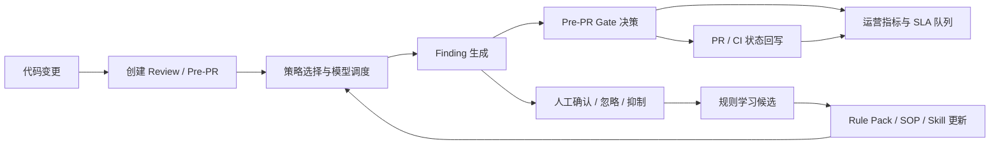

# Review Agent 产品设计与平台演进计划

**更新日期：** 2026-06-11

## 1. 产品定位

Review Agent 当前应定位为 **面向 AI Coding 时代的研发质量治理平台**，而不是单点 AI Code Review 工具。

它的核心价值不是“让模型帮忙看代码”，而是把代码变更、模型审查、人工确认、质量门禁、规则沉淀、工程集成和运营指标串成闭环，帮助团队在 AI 生成代码占比提升后，仍然能控制质量、风险、安全和技术债。

一句话描述：

> Review Agent 是一个把 AI Review 前置到 Pre-PR 阶段，并通过多模型策略、质量门禁、人工确认和治理运营闭环支撑团队交付准入的平台。

## 2. 当前产品形态

### 2.1 已具备的产品模块

当前产品已经形成了前后端分离的研发治理平台雏形，主要模块如下：

| 模块 | 当前能力 | 成熟度判断 |
| --- | --- | --- |
| 登录与鉴权 | 注册、登录、登出、JWT 鉴权、前端登录态存储、路由守卫 | 可用，后续需补 RBAC、会话失效、审计 |
| 项目管理 | Git 仓库登记、默认分支、克隆状态、失败信息、分支读取 | 基础闭环可用 |
| Review 创建 | 支持选择项目、源分支、目标分支、审查策略，发起 Review/Pre-PR 审查 | 可用，但 Pre-PR 语义还需后端增强 |
| Review 详情 | 展示审查状态、模型结果、Finding、人工确认、风险、测试计划、重构计划 | 展示能力较完整 |
| 多模型策略 | Provider、Profile、Review Strategy、角色绑定、策略种子数据 | 配置基础已具备，缺少效果遥测 |
| Pre-PR Gate | 数据库已有 `pre_pr_gate`，前端可推导 Gate 状态 | 概念成立，但后端领域闭环不足 |
| 治理中心 | 治理能力目录、连接器、规则包、工作流模板 | 更像能力地图，尚未成为操作台 |
| 运营中心 | 风险队列、SLA 压力、业务影响、规则学习候选等前端指标逻辑 | 指标视角已具备，缺少持久化运营工作流 |
| AI Gateway | Prompt、调用统计、模型配置入口 | 入口存在，缺少生产级可观测和控制面 |
| 知识与 Memory | 知识查询、Team Memory、知识图谱相关结构 | 概念预留较多，闭环不足 |
| CI/集成 | CI 配置、写回日志、Webhook、Integration 相关结构 | 结构已出现，真实交付闭环仍需打通 |
| Agent 能力 | Agent、Skill、Tool、MCP、Judge、Fix Draft、SARIF、测试生成、重构计划等结构 | 积木丰富，但执行契约和审计边界还不清晰 |

### 2.2 当前用户工作流

当前最清晰的主链路是：

1. 用户注册/登录。
2. 创建项目并登记 Git 仓库。
3. 系统克隆仓库并读取分支。
4. 用户选择项目、源分支、目标分支、审查策略，创建 Review。
5. 系统生成 diff，调度模型执行审查。
6. Review 详情页展示模型结果、Finding、严重级别、人工确认状态和智能分析。
7. 前端根据 Finding 严重级别、人工状态、模型成功率推导 Gate 状态。
8. 用户在 Dashboard、Governance、Operations 等页面查看质量和治理视角。

这条链路已经能支撑演示和小规模试用。但如果要进入真实研发交付，还缺三件关键事：

- Gate 决策必须由后端持久化、可审计、可回放。
- Gate 结果必须回写到 GitHub/GitLab/CI 等真实准入系统。
- 人工确认结果必须反哺规则、策略和运营队列。

## 3. 产品架构设计

### 3.1 能力域划分

建议将平台划分为 8 个能力域：

| 能力域 | 责任 | 关键对象 |
| --- | --- | --- |
| Identity & Tenant | 用户、组织、团队、权限、会话 | User、Role、Team、Tenant |
| Project & Repo | 项目、仓库、分支、diff、commit | Project、Repository、Branch、Diff |
| Review Core | Review 任务、Finding、模型执行结果 | Review、Finding、ModelResult |
| Pre-PR Gate | 质量门禁、阻断原因、人工决策 | Gate、Decision、BlockedReason |
| Model & AI Gateway | 模型供应商、模型档案、策略、调用记录 | Provider、Profile、Strategy、ModelCall |
| Governance | 规则包、SOP、Skill、治理能力目录 | RulePack、Rule、SOP、Skill |
| Integration | GitHub/GitLab、CI、SARIF、Webhook、Issue Tracker | Connector、WebhookEvent、WritebackLog |
| Operations | 指标、SLA、Owner 队列、反馈学习 | Metric、QueueItem、Feedback、AuditLog |

当前代码已经覆盖其中大部分概念，但成熟度不均衡。后续要避免继续横向堆页面，应按“一个能力域一条闭环”的方式补齐。

### 3.2 目标闭环

目标闭环应从“模型审查”升级为“治理反馈系统”：

这条闭环的产品含义是：

- AI 负责发现问题，但不能直接独裁。
- Gate 负责合并准入，但必须可解释、可审计。
- 人工确认不是一次性动作，而是治理资产的来源。
- 运营中心不是展示报表，而是推动风险处理和规则改进。

### 3.3 数据与状态设计原则

后续平台演进中，以下状态必须从“前端推导”迁移到“后端持久化”：

| 状态 | 当前问题 | 目标设计 |
| --- | --- | --- |
| Gate 状态 | 前端可推导，但刷新、审计、集成不可靠 | 后端 `PrePrGateService` 统一计算、持久化、返回 |
| 人工决策 | Finding 有人工状态，但 Gate 决策链路不完整 | 记录 decision、reason、decidedBy、decidedAt、history |
| 模型调用 | 有模型结果表，缺少遥测维度 | 记录耗时、token、成本、错误、retry、prompt 版本 |
| Finding 生命周期 | 创建和人工状态已有基础 | 增加确认、忽略、抑制、转 Issue、转规则的完整事件 |
| 集成回写 | 已有 CI 配置和写回日志 | 明确 pending/success/failure/retry 状态机 |
| 规则演进 | 有规则包和治理目录 | 增加版本、发布、回滚、dry-run、命中历史、Owner |

## 4. 当前主要问题

### 4.1 核心链路还没有真正进入交付系统

平台已经能展示 Review 结果，但还没有稳定完成“阻断合并”的产品动作。Pre-PR Gate 如果不能回写 PR/CI，就仍然是建议系统，不是准入系统。

### 4.2 治理中心偏目录化

治理能力、连接器、规则包、工作流模板已经存在，但缺少日常治理动作：

- 谁负责这个规则？
- 规则何时发布？
- 误报如何抑制？
- 确认的问题如何转规则？
- 哪个策略最近误报最高？
- 哪些 BLOCKER 超过 SLA？

这些问题决定治理中心能否从“展示页”变成“工作台”。

### 4.3 AI Gateway 缺少生产控制面

多模型策略已经有雏形，但缺少规模化所需的遥测、预算、降级、重试、熔断、Prompt 版本和效果评估。没有这些能力，模型策略很难被团队信任。

### 4.4 Agent 能力边界不清

仓库里已经出现 Agent、Skill、Tool、MCP、Judge、Fix Draft 等关键部件。但后续必须明确：

- 每个 Agent 可以读什么上下文。
- 可以调用哪些工具。
- 每一步是否可回放。
- Judge 如何裁决多个 Worker。
- 修复草稿是否需要人工审批。

否则 Agent 化会从效率工具变成安全和仓库完整性风险。

### 4.5 工程可信度仍需补强

当前仍存在两个工程风险：

- 部分核心 Java 文件读取时出现 `Esafenet` 保护内容，影响审计和重构。
- 后端测试和端到端测试不足，前端 helper 测试相对更多。

## 5. 后续平台功能清单

### P0：平台可信化与核心 Gate 闭环

| 功能 | 目标 | 交付物 |
| --- | --- | --- |
| 受保护源码盘点 | 明确哪些核心代码可维护、哪些需要隔离 | 源码风险清单、处理决策 |
| 文档与编码修复 | 核心文档、README、API 清单中文可读 | UTF-8 文档、验证命令 |
| 后端 Pre-PR Gate 服务 | Gate 状态由后端统一计算和持久化 | `PrePrGateService`、Gate API |
| 人工 Gate 决策 | 支持通过/阻断/需复核及原因记录 | 决策接口、审计字段 |
| Review 详情接入后端 Gate | 前端展示后端返回状态 | Gate 状态卡、阻断原因 |
| Gate 测试覆盖 | 核心门禁逻辑可验证 | blocker、major、dismissed、override 测试 |

### P1：PR/CI 集成与标准输出

| 功能 | 目标 | 交付物 |
| --- | --- | --- |
| GitHub/GitLab 状态回写 | Gate 结果进入分支保护链路 | Commit Status 或 Checks 回写 |
| CI 写回日志 | 失败可追踪、可重试 | writeback log、retry 状态 |
| Webhook 强化 | 外部事件可信接入 | 签名校验、幂等、投递日志 |
| SARIF 导出 | Finding 进入代码扫描生态 | SARIF 下载/上传接口 |
| PR Summary 回写 | Review 结论直接出现在 PR | 摘要生成、评论回写 |
| 集成配置页面 | 仓库级配置可维护 | token secret、状态上下文、启用开关 |

### P2：策略效果与治理运营

| 功能 | 目标 | 交付物 |
| --- | --- | --- |
| 模型调用遥测 | 衡量成本、耗时、失败、效果 | `model_call_record`、指标服务 |
| 策略效果看板 | 比较策略、模型、规则表现 | 命中率、确认率、误报代理、成本 |
| Finding 生命周期 | 从发现到确认、抑制、转 Issue、转规则 | 事件表、状态流转 |
| 运营队列 | 把风险变成可处理任务 | Owner、SLA、优先级、业务影响 |
| 规则学习候选 | 人工确认反哺规则 | 候选生成、采纳/拒绝 |
| 抑制机制 | 管理误报和例外 | suppression、有效期、Owner |

### P3：Rule / Skill / SOP 生命周期

| 功能 | 目标 | 交付物 |
| --- | --- | --- |
| 规则编辑与版本 | 团队经验可管理 | Rule、RulePack version |
| 发布与回滚 | 规则变更可控 | publish、rollback、audit |
| Dry-run | 上线前评估误伤 | 历史 Finding 回放 |
| SOP 结构化 | 文档经验转执行约束 | SOP section 到 Rule/Skill 映射 |
| Skill 管理 | Agent 使用稳定规则能力 | Skill registry、适用范围 |
| 治理模板 | 不同团队可复用治理方案 | 模板库、推荐策略 |

### P4：Agent 执行契约与可控修复

| 功能 | 目标 | 交付物 |
| --- | --- | --- |
| Agent Role Contract | 明确输入、工具、输出、超时 | role schema、tool allowlist |
| Agent 执行日志 | 每一步可回放、可审计 | step log、tool call log |
| 多 Agent 去重合并 | 降低噪声 | merge policy、归因记录 |
| Judge 解释 | 裁决可追踪 | evaluation、confidence、override reason |
| Fix Draft | 从发现问题到修复建议 | patch summary、测试建议、回滚说明 |
| 人工审批修复 | 防止自动改坏仓库 | approval flow、apply gate |

### P5：企业级就绪

| 功能 | 目标 | 交付物 |
| --- | --- | --- |
| 组织/团队/租户 | 支撑多团队使用 | tenant、team、membership |
| RBAC | 权限边界清晰 | admin、maintainer、reviewer、viewer |
| 审计日志 | 敏感动作可追踪 | audit log |
| 密钥管理 | 保护模型 Key、仓库 Token、Webhook Secret | secret abstraction |
| 数据保留策略 | 控制 diff、prompt、response、finding 生命周期 | retention policy |
| 部署与运维 | 生产环境稳定运行 | health check、profile、metrics |

## 6. 分阶段计划

### 阶段 0：可信化修复

**周期：** 3-5 天

**目标：** 让仓库、文档、源码和验证命令可信。

**重点：**

- 盘点受保护源码。
- 修复核心文档编码。
- 更新 API 清单。
- 统一本地验证命令。
- 补关键后端编译和前端测试说明。

**退出标准：**

- 新协作者能按 README 启动和验证。
- 核心文档中文可读。
- 受保护源码有明确风险记录。

### 阶段 1：Pre-PR Gate 后端化

**周期：** 1-2 周

**目标：** 把 Gate 从前端推导变成后端领域能力。

**重点：**

- Gate domain contract。
- Gate 持久化服务。
- Gate 查询与人工决策 API。
- Review 详情接入后端 Gate。
- Gate 决策测试。

**退出标准：**

- Gate 状态刷新后仍存在。
- 人工决策可审计。
- 前端展示后端 Gate 结果。

**当前完成状态（2026-06-11）：**

- Gate 查询、刷新、初始化和人工决策 API 已落地到可维护的 `PrePrGateController`。
- Gate 状态由 `PrePrGateService` 计算并持久化到 `pre_pr_gate`。
- Pre-PR 创建成功后前端会显式初始化 Gate，详情页优先展示后端 Gate。
- 人工决策写入 `decidedBy`、`decidedAt`、阻断原因，并追加到 `pre_pr_gate_history`。
- 阶段 1 退出标准已满足；下一阶段进入 PR/CI 闭环、Webhook、SARIF 和 PR Summary。

### 阶段 2：PR/CI 闭环

**周期：** 2-3 周

**目标：** 让平台进入真实交付链路。

**重点：**

- GitHub/GitLab Status 或 Checks。
- Webhook 签名、幂等、重试。
- SARIF 导出。
- PR Summary 回写。
- 集成失败进入运营视图。

**退出标准：**

- PR 上能看到 Review Agent 状态。
- Finding 可导出为 SARIF。
- 回写失败可追踪、可重试。

### 阶段 3：策略效果与运营工作台

**周期：** 2-4 周

**目标：** 从“能审查”升级为“能运营”。

**重点：**

- 模型调用遥测。
- 策略效果看板。
- Finding 生命周期。
- Owner/SLA 队列。
- 规则学习候选。

**退出标准：**

- 能回答哪个策略更准、更贵、更慢。
- 人工反馈能转成治理候选。
- 风险项能按 Owner 和 SLA 跟踪。

### 阶段 4：规则资产化

**周期：** 3-4 周

**目标：** 把团队经验变成可执行、可版本化、可回滚的规则资产。

**重点：**

- Rule Pack 版本。
- 规则发布与回滚。
- 历史 Finding dry-run。
- SOP 到 Rule/Skill 映射。
- 误报抑制。

**退出标准：**

- 团队可以发布规则包。
- 规则效果可观察。
- 人工确认能改善后续审查。

### 阶段 5：可控 Agent 与修复闭环

**周期：** 4-6 周

**目标：** 让 Agent 从概念积木变成可控自动化系统。

**重点：**

- Agent role contract。
- Tool allowlist。
- 执行回放。
- Judge 解释。
- Fix Draft。
- 人工审批应用。

**退出标准：**

- Agent 每一步可审计。
- 修复建议不会绕过人工确认。
- 多 Agent 输出可以合并降噪。

### 阶段 6：企业级能力

**周期：** 4-6 周

**目标：** 支撑多团队、长期、稳定使用。

**重点：**

- 组织/团队/租户。
- RBAC。
- 审计日志。
- 密钥管理。
- 数据保留策略。
- 生产运维指标。

**退出标准：**

- 多团队数据和配置隔离。
- 敏感操作可审计。
- 密钥不明文暴露。

## 7. 推荐近期执行顺序

推荐短期不要继续扩展新页面，而是按以下顺序推进：

1. **先做阶段 0：可信化修复。** 解决源码、文档、验证命令和 API 清单的可信度。
2. **再做阶段 1：Pre-PR Gate 后端化。** 这是平台从“审查助手”变成“准入系统”的关键。
3. **随后做阶段 2：PR/CI 闭环。** 让 Gate 结果进入真实研发流程。
4. **再进入阶段 3：策略和运营。** 用数据证明模型、策略和规则是否有效。

如果只能选择一个最优先功能，建议选择：

> 后端持久化 Pre-PR Gate，包括 Gate API、人工决策、阻断原因和 Review 详情页接入。

原因是它承上启下：

- 向前承接当前 Review 和 Finding。
- 向后支撑 PR/CI 回写。
- 向运营侧提供可统计的准入结果。
- 向治理侧提供规则学习和人工反馈来源。

## 8. 成功指标

| 指标 | 说明 |
| --- | --- |
| Pre-PR Gate 采纳率 | 使用 Pre-PR 模式创建的 Review 占比 |
| Gate 可信度 | 后端持久化 Gate 决策占所有 Gate 决策的比例 |
| 阻断有效率 | 被 BLOCKED 后最终确认有效的问题比例 |
| 人工确认率 | Finding 被确认或忽略的比例 |
| 误报代理指标 | ignored / dismissed Finding 占比 |
| 策略成本效率 | 单位模型成本产生的确认 Finding 数 |
| 决策耗时 | Review 开始到 passed、blocked 或人工决策的耗时 |
| 集成覆盖率 | 启用 PR/CI 状态回写的仓库占比 |
| 治理转化率 | 确认 Finding 转规则、SOP 或 Issue 的比例 |
| SLA 压力 | 超时未处理 BLOCKER/MAJOR Finding 数 |

## 9. 关键风险

| 风险 | 影响 | 缓解 |
| --- | --- | --- |
| 受保护 Java 源码无法审计 | 阻断深度后端演进 | 恢复源码，或通过稳定接口和黑盒测试隔离 |
| Gate 继续由前端推导 | 决策不可审计、无法集成 | 后端化 Gate 服务和状态机 |
| 先堆展示页 | 产品看似丰富但不能进入交付 | 优先做 PR/CI、SARIF、Webhook |
| 多模型噪声和成本不可控 | 团队不信任平台 | 增加遥测、预算、策略效果评估 |
| Agent 工具边界不清 | 带来安全和仓库完整性风险 | role contract、tool allowlist、执行日志 |
| 人工反馈不沉淀 | 治理不能持续进化 | Finding 生命周期和规则学习候选 |
| 企业能力过早投入 | 拖慢核心价值验证 | Gate 和 CI 闭环完成后再补租户/RBAC |

## 10. 结论

Review Agent 当前已经完成了从 AI Review Demo 到研发治理平台雏形的跨越。下一阶段的重点不是继续扩页面，而是把核心价值链打穿：

**Review 发现问题 -> Gate 形成准入决策 -> PR/CI 执行阻断 -> 人工确认沉淀反馈 -> 规则和策略持续进化。**

只要 Pre-PR Gate 后端化和 PR/CI 回写完成，产品就会从“一个能看代码的 AI 工具”升级为“可以嵌入团队交付流程的治理系统”。这是后续所有 AI Gateway、Rule、Agent、Fix Draft 和企业级能力的地基。
